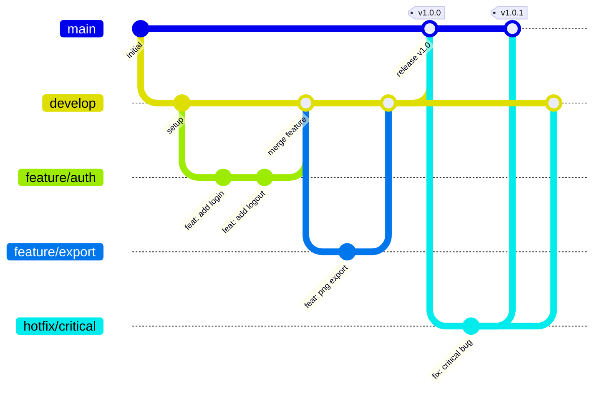

# Contributing to Mermaid Tunner

Thank you for your interest in contributing! This guide will help you get started.

## Git Branch Strategy

We follow a structured branching model to maintain code quality and enable parallel development.



### Branch Types

| Branch | Purpose | Base | Merges Into |
|--------|---------|------|-------------|
| `main` | Production-ready code | - | - |
| `develop` | Integration branch | `main` | `main` |
| `feature/*` | New features | `develop` | `develop` |
| `hotfix/*` | Critical production fixes | `main` | `main` + `develop` |
| `release/*` | Release preparation | `develop` | `main` + `develop` |

### Branch Naming Convention

```
<type>/<short-description>
```

**Examples:**
- `feature/user-authentication`
- `fix/diagram-rendering`
- `docs/api-documentation`
- `refactor/editor-cleanup`
- `hotfix/critical-export-bug`

## Getting Started

### 1. Fork and Clone

```bash
# Fork the repository on GitHub, then:
git clone https://github.com/YOUR_USERNAME/mermaid-tunner.git
cd mermaid-tunner
```

### 2. Set Up Upstream

```bash
git remote add upstream https://github.com/PedroVMota/mermaid-tunner.git
```

### 3. Create a Feature Branch

```bash
# Always branch from develop
git checkout develop
git pull upstream develop
git checkout -b feature/your-feature-name
```

### 4. Make Your Changes

```bash
# Install dependencies
npm install

# Start development server
npm run dev

# Run tests before committing
npm run lint
npm run build
```

## Commit Convention

We use [Conventional Commits](https://www.conventionalcommits.org/). All commits must follow this format:

```
<type>(<scope>): <description>

[optional body]

[optional footer]
```

### Types

| Type | Description |
|------|-------------|
| `feat` | New feature |
| `fix` | Bug fix |
| `docs` | Documentation changes |
| `style` | Code style (formatting, semicolons, etc.) |
| `refactor` | Code refactoring |
| `perf` | Performance improvements |
| `test` | Adding or updating tests |
| `build` | Build system or dependencies |
| `ci` | CI/CD changes |
| `chore` | Other changes (maintenance) |

### Examples

```bash
# Feature
git commit -m "feat(editor): add syntax highlighting for mermaid code"

# Bug fix
git commit -m "fix(export): resolve PNG transparency issue"

# Documentation
git commit -m "docs(readme): update installation instructions"
```

## Pull Request Process

### 1. Push Your Branch

```bash
git push origin feature/your-feature-name
```

### 2. Create a Pull Request

- Go to GitHub and create a PR from your branch to `develop`
- Fill in the PR template with:
  - Clear description of changes
  - Steps to test
  - Screenshots (if UI changes)

### 3. Add Labels for Release

Add one of these labels to indicate the version bump:

| Label | Version Bump | When to Use |
|-------|--------------|-------------|
| `breaking-change` | MAJOR (x.0.0) | Breaking API/behavior changes |
| `feature` / `feat` | MINOR (0.x.0) | New features |
| `bugfix` / `fix` | PATCH (0.0.x) | Bug fixes |

### 4. Code Review

- Address reviewer feedback
- Keep the PR focused and small
- Ensure CI passes

### 5. Merge

Once approved, a maintainer will merge your PR. The release workflow will automatically:
- Bump the version based on labels
- Update the changelog
- Create a git tag
- Publish a GitHub release

## Development Guidelines

### Code Style

- Use TypeScript strict mode
- Follow existing code patterns
- No `any` types - use proper typing
- Use named exports

### Component Guidelines

- Server Components by default
- Only use `"use client"` when necessary
- Keep components small and focused
- Use Tailwind CSS for styling

### Testing

Before submitting a PR:

```bash
# Type check
npx tsc --noEmit

# Lint
npm run lint

# Build
npm run build
```

## Questions?

- Open an issue for bugs or feature requests
- Start a discussion for questions

Thank you for contributing!
