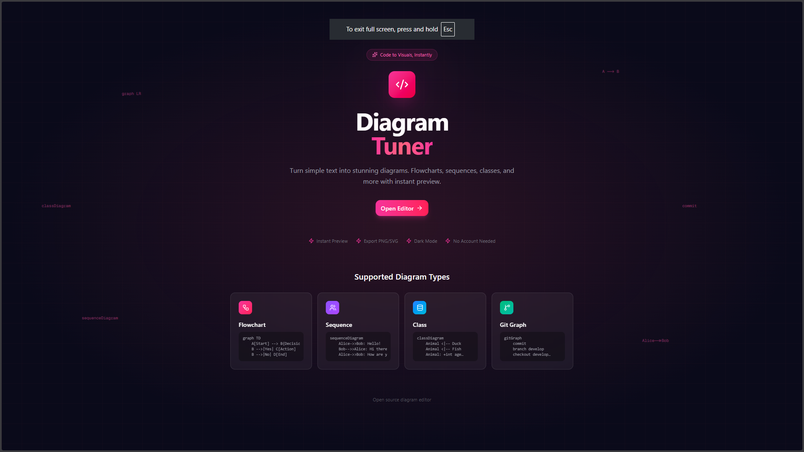
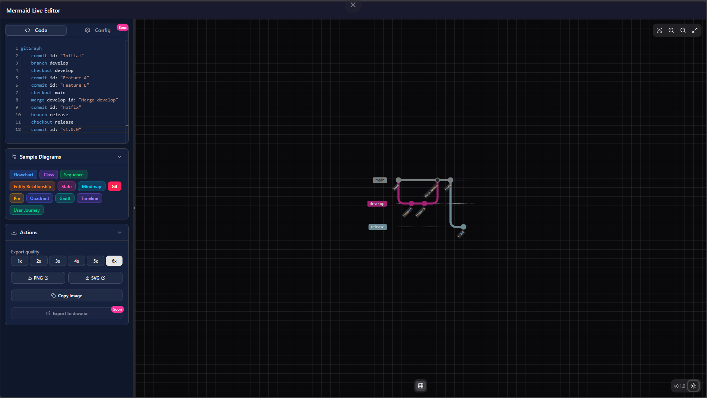
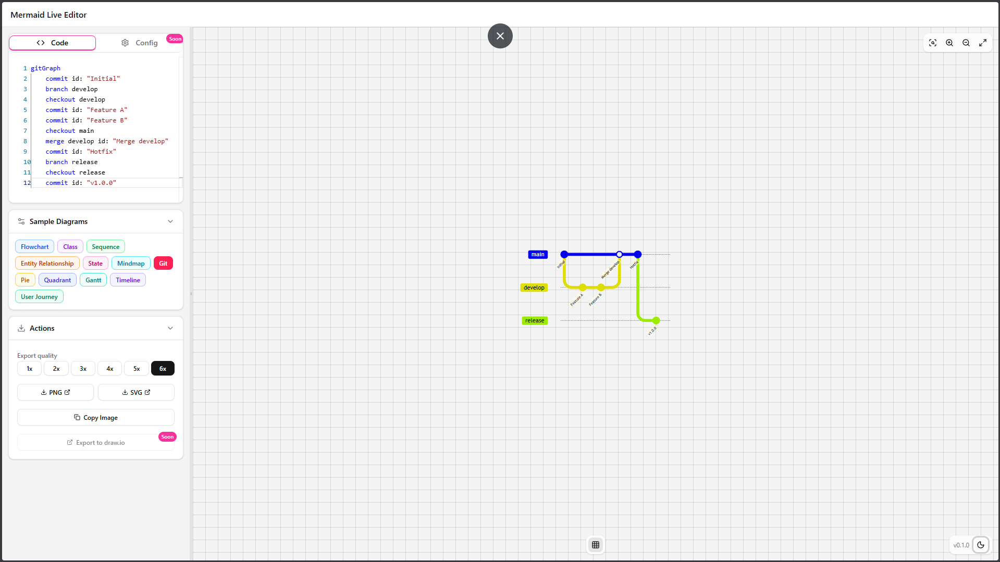

# Diagram Tuner

A modern, open-source diagram editor with live preview. Turn simple text into stunning diagrams using Mermaid syntax.



## Screenshots

| Dark Mode | Light Mode |
|-----------|------------|
|  |  |

## Features

- **Live Preview** — See your diagrams render in real-time as you type
- **Multiple Diagram Types** — Flowcharts, sequence diagrams, class diagrams, git graphs, and more
- **Export Options** — Download as PNG or SVG with customizable scale
- **Copy to Clipboard** — One-click copy diagram as image
- **Dark/Light Mode** — Full theme support for comfortable editing
- **Pan & Zoom** — Navigate complex diagrams with mouse controls
- **Fit to Screen** — Auto-scale diagrams to viewport
- **Sample Templates** — Quick-start with pre-built diagram examples
- **No Account Required** — Start creating immediately, no sign-up needed

## Tech Stack

- **Framework:** Next.js 15 (App Router)
- **Language:** TypeScript
- **Styling:** Tailwind CSS
- **UI Components:** shadcn/ui
- **Diagrams:** Mermaid.js
- **Icons:** Lucide React

## Getting Started

### Prerequisites

- Node.js 20.9.0 or higher
- npm, yarn, pnpm, or bun

### Installation

```bash
# Clone the repository
git clone https://github.com/your-username/diagram-tuner.git
cd diagram-tuner

# Install dependencies
npm install

# Start the development server
npm run dev
```

Open [http://localhost:3000](http://localhost:3000) in your browser.

## Project Structure

```
src/
├── app/
│   ├── page.tsx              # Landing page
│   ├── editor/
│   │   └── page.tsx          # Diagram editor page
│   ├── layout.tsx            # Root layout
│   └── globals.css           # Global styles
├── components/
│   ├── mermaid/
│   │   ├── mermaid-editor.tsx    # Main editor component
│   │   ├── mermaid-preview.tsx   # Diagram preview with pan/zoom
│   │   ├── code-editor.tsx       # Code input area
│   │   ├── editor-sidebar.tsx    # Sidebar with samples & export
│   │   ├── editor-header.tsx     # Header navigation
│   │   └── preview-controls.tsx  # Zoom/fullscreen controls
│   └── ui/                   # shadcn/ui components
└── lib/
    ├── export-utils.ts       # PNG/SVG export logic
    ├── mermaid-samples.ts    # Sample diagram templates
    └── utils.ts              # Utility functions
```

## Usage

### Editor Controls

| Action | Control |
|--------|---------|
| Pan diagram | Alt + Click & Drag or Middle Mouse |
| Zoom in/out | Ctrl/Cmd + Scroll |
| Fit to screen | Click the fit icon in controls |
| Toggle fullscreen | Click the expand icon |
| Toggle grid | Click the grid icon |
| Toggle theme | Click the sun/moon icon |

### Supported Diagram Types

- Flowchart / Graph
- Sequence Diagram
- Class Diagram
- State Diagram
- Entity Relationship Diagram
- Git Graph
- Pie Chart
- Mindmap
- Timeline
- And more...

For full syntax reference, see [Mermaid Documentation](https://mermaid.js.org/intro/).

## Scripts

```bash
npm run dev      # Start development server
npm run build    # Build for production
npm run start    # Start production server
npm run lint     # Run ESLint
```

## Contributing

Contributions are welcome! Please feel free to submit a Pull Request.

1. Fork the repository
2. Create your feature branch (`git checkout -b feat/amazing-feature`)
3. Commit your changes (`git commit -m 'feat: add amazing feature'`)
4. Push to the branch (`git push origin feat/amazing-feature`)
5. Open a Pull Request

## License

This project is open source and available under the [MIT License](LICENSE).

---

Built with [Next.js](https://nextjs.org) and [Mermaid](https://mermaid.js.org)
